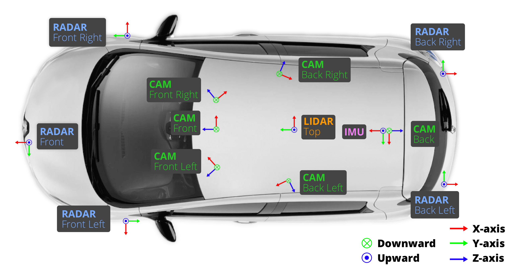
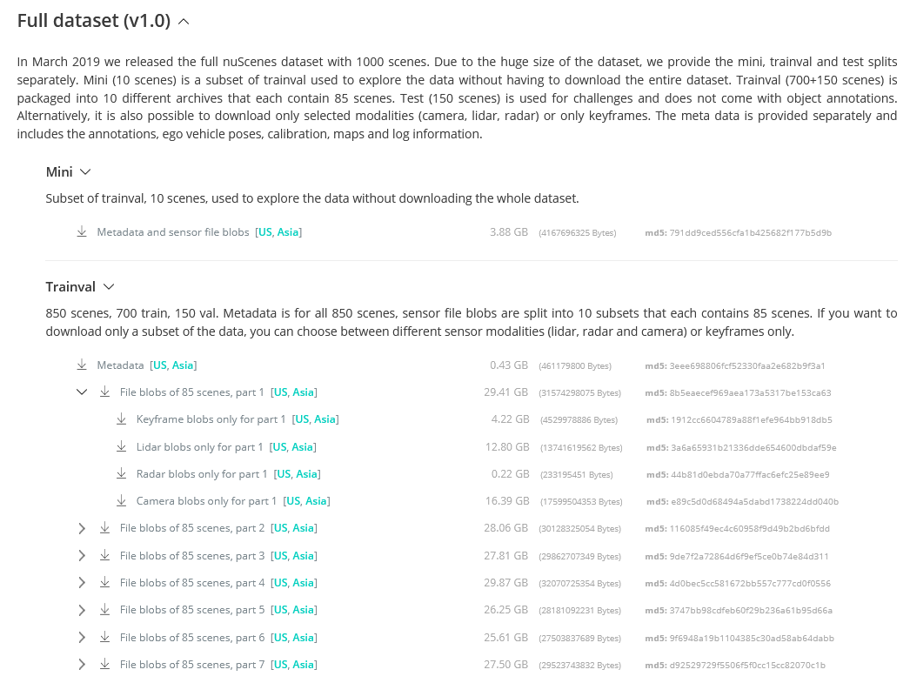

# [English document](../README.md)

# 数据集简介

[https://blog.csdn.net/weixin_40994913/article/details/83663270](https://blog.csdn.net/weixin_40994913/article/details/83663270)
nuScenes数据集 是自动驾驶公司nuTonomy建立的大规模自动驾驶数据集，该数据集包含了**6个摄像头、1个360度激光雷达、5个毫米雷达、1个GPS及1个惯性测量传感器**。



该数据集由1000个场景组成（即scenes，这就是该数据集名字的由来），涵盖了140万张图片，经历了 39 万条激光雷达扫描、雷达、GPS 和加速计数据（旨在判定目标物间的距离）及140 万个3D边界盒（bounding boxes）（利用RGB摄像头、雷达及激光雷达探查目标物）；每个scenes长度为20秒，包含了各种各样的情景。在每一个scenes中，有40个关键帧（key frames），也就是每秒钟有2个关键帧，其他的帧为sweeps。关键帧经过手工的标注，每一帧中都有了若干个标注，标注的形式为bounding box。不仅标注了大小、范围、还有类别、可见程度等等。
这个数据集在sample的数量上、标注的形式上都非常好，记录了车的自身运动轨迹（相对于全局坐标），包含了非常多的传感器，可以用来实现更加智慧的识别算法和感知融合算法。

## 传感器说明

激光雷达：

- 20Hz采集频率
- 32线
- 360度水平FOV，+10~-30度的垂直FOV
- 80~10m的可视范围，2cm的精度
- 每秒139万个点

5个远距离毫米波雷达:

- 77GHz
- 13Hz采集频率
- 调制连续波
- 250m可视范围
- 0.1km/h的速度精度

6个摄像头

- 12Hz采集频率

- 1/1.8'' CMOS sensor of 1600x1200 resolution

- Bayer8 format for 1 byte per pixel encoding

- 1600x900 ROI is cropped from the original resolution to reduce processing and transmission bandwidth

- Auto exposure with exposure time limited to the maximum of 20 ms

- Images are unpacked to BGR format and compressed to JPEG

- See camera orientation and overlap in the figure below.

  

- 

详细介绍请阅读[*这里*](https://www.nuscenes.org/nuscenes)

## 传感器标定

车辆坐标系设置为车辆后轴中心。

- 激光雷达外参标定：

使用激光线准确测量机关雷达相对后轴中心的位置。

- 相机外参标定:

先通过校准相机相对激光雷达的位置，在转换到后轴中心。


# 数据集下载

下载地址:[传送门](https://www.nuscenes.org/download)



- **Metadata**包含v1.0-trainval文件夹，该文件夹中包含所有850个场景的配置文件标注, 车辆姿态, 校准, 地图、 日志信息。

- 所有的图像和点云数据被分成十个部分。每个**File blobs**包含samples和sweeps两个文件夹，samples表示各传感器时间轴对应时的数据，sweeps表示其他剩余数据。samples和sweeps两个文件夹下，各有12个文件夹，分别为6路摄像头数据，1路激光雷达数据，5路毫米波雷达数据。

- 实际使用时，可以只下载**Keyframe**数据，此时仅包括samples数据。因为实际训练预测，基本上都是基于samples内的数据。

- 也可只下载某一传感器数据，例如只下载**Lidar blobs**，此时下载内容也包括samples和sweeps两个文件夹，但这两个文件夹下只包含激光雷达数据。**Radar blobs**和**Camera blobs**同理。

  

  

# 标注数据格式

文件说明：

| 文件                       | 说明                                                         |
| -------------------------- | ------------------------------------------------------------ |
| **category.json**          | 出现在数据集中的物体的类别，一共23类                         |
| **attribute.json**         | 描述了物体本身的状态，比如行驶、停下等                       |
| **visibility.json**        | 描述一个物体可视的程度，即被遮挡、截断的程度，用百分比来表示 |
| **instance.json**          | 以实例为单位，记录某个实例出现的帧数、初始token、结尾token等 |
| **sensor.json**            | 保存所有传感器的数据表，包含一些简单的传感器类型。           |
| **calibrated_sensor.json** | 标定信息，包括了外参和内参。每一个照片，都有一个对应的相机标注。 |
| **ego_pose**               | 相机所在车的标注信息                                         |
| **log.json**               | 一些场景、日期的日志信息                                     |
| **scene.json**             | 场景数据表                                                   |
| **sample.json**            | 照片的标注，以照片为单位，一张照片对应一个sample             |
| **sample_data.json**       | sample对应的简单信息，不包括标注，可以索引出同一个物体前后帧的信息 |
| **sample_annotation.json** | 物体的标注信息                                               |
| **map.json**               | 地图相关的一些标注信息，数据集的map文件夹里面会包括map的图片 |
| **image_annotations.json** | 本表包括了2DBbox等信息                                       |


### attribute

描述了物体本身的一些状态，可以在类别保持不变的情况下进行更改。例如：停车/停止/移动的车辆，以及自行车是否有骑手。

```
attribute {
   "token":                   <str> -- 唯一标识符.
   "name":                    <str> -- 属性名称(共8种).
   "description":             <str> -- 属性描述.
}
```

### calibrated_sensor

在特定车辆上校准的特定传感器（雷达/雷达/摄像机）的定义。给出了所有相对于车辆后轴坐标系的外部参数。

```
calibrated_sensor {
   "token":                   <str> -- Unique record identifier.
   "sensor_token":            <str> -- 从sensor.json中对应得到传感器类型.
   "translation":             <float> [3] -- 平移矩阵，以米为单位: x, y, z.
   "rotation":                <float> [4] -- 姿态四元数: w, x, y, z.
   "camera_intrinsic":        <float> [3, 3] -- 相机内参.
}
```

### category

出现在数据集中的物体的类别，一共23类 (e.g. `human.pedestrian.adult`).

```
category {
   "token":                   <str> -- Unique record identifier.
   "name":                    <str> -- Category name. Subcategories indicated by period.
   "description":             <str> -- Category description.
   "index":                   <int> -- The index of the label used for efficiency reasons in the .bin label files of nuScenes-lidarseg. This field did not exist previously.
}
```

### ego_pose

自身车辆在特定时间戳下的在地图全局坐标系下的姿态。ego_pose描述的是基于激光雷达图的定位算法的输出。定位在x-y平面上是二维的。

```
ego_pose {
   "token":                   <str> -- 唯一标识.
   "translation":             <float> [3] -- Coordinate system origin in meters: x, y, z. Note that z is always 0.
   "rotation":                <float> [4] -- Coordinate system orientation as quaternion: w, x, y, z.
   "timestamp":               <int> -- Unix时间戳.
}
```

ego车辆，还有照片中其他车辆（sample_annotation.json）的外参，参考坐标系是世界坐标系，世界坐标系的原点是lidar或radar定义的，没有什么规律，所以要求其他车辆的相机坐标系坐标，就需要在这三个外参（ego、camera、sample）换算一下。

### instance

以实例为单位，记录某个实例出现的帧数、初始token、结尾token等.

```
instance {
   "token":                   <str> -- Unique record identifier.
   "category_token":          <str> -- 类别标识，可以找到category.json里的对应类别.
   "nbr_annotations":         <int> -- 出现的数量，即该实例在此数据集一共出现了多少帧
   "first_annotation_token":  <str> -- 第一帧的annotation标识，在sample_annonation.json里可以找到对应标注，下同
   "last_annotation_token":   <str> -- 最后一帧的annotation标识.
}
```

### lidarseg

nuScenes-lidarseg批注和与关键帧关联的激光雷达点云对应的sample_datas之间的映射。 

```
lidarseg {
   "token":                   <str> -- Unique record identifier.
   "filename":                <str> -- 包含nuScenes-lidarseg标签的.bin文件的名称。这些是uint8的numpy数组，使用numpy以二进制格式存储.
   "sample_data_token":       <str> -- Foreign key. 对应于带is_key_frame = True的带注释的激光雷达点云的Sample_data。 
}
```

### log

一些场景、日期的日志信息.

```
log {
   "token":                   <str> -- 唯一标识.
   "logfile":                 <str> -- 日志文件.
   "vehicle":                 <str> -- 车辆名称.
   "date_captured":           <str> -- 拍摄日期 (YYYY-MM-DD).
   "location":                <str> -- 拍摄地点, e.g. singapore-onenorth.
}
```

### map

地图相关的一些标注信息，数据集的map文件夹里面会包括map的图片.

```
map {
   "token":                   <str> -- 唯一标识.
   "log_tokens":              <str> [n] -- 地图中的日志文件.
   "category":                <str> -- 地图类别，当前仅适用于可驾驶表面和人行道的semantic_prior。
   "filename":                <str> -- 对应的地图文件名.
}
```

### sample

A sample is an annotated keyframe at 2 Hz. The data is collected at (approximately) the same timestamp as part of a single LIDAR sweep.

```
sample {
   "token":                   <str> -- Unique record identifier.
   "timestamp":               <int> -- Unix time stamp.
   "scene_token":             <str> -- Foreign key pointing to the scene.
   "next":                    <str> -- Foreign key. Sample that follows this in time. Empty if end of scene.
   "prev":                    <str> -- Foreign key. Sample that precedes this in time. Empty if start of scene.
}
```

### sample_annotation

A bounding box defining the position of an object seen in a sample. All location data is given with respect to the global coordinate system.

保存了物体的标注信息。一个边界框，用于定义在样本中看到的对象的位置。所有位置数据都是相对于全局坐标系给出的。

```
sample_annotation {
   "token":                   <str> -- 唯一标识.
   "sample_token":            <str> -- 从sample.json中索引出唯一对应的sample.
   "instance_token":          <str> -- 从instance.json中索引出唯一对应的instance.
   "attribute_tokens":        <str> [n] -- 从attribute.json中索引出唯一对应的attribute.
   "visibility_token":        <str> -- 从visibility.json中索引出唯一对应的visibility.
   "translation":             <float> [3] -- 物体外参，偏移矩阵，单位为米 center_x, center_y, center_z.
   "size":                    <float> [3] -- 物体大小，单位为米，顺序为width, length, height.
   "rotation":                <float> [4] -- 物体外参，四元数旋转矩阵.
   "num_lidar_pts":           <int> -- bbox中出现的lidar点数量，下同.
   "num_radar_pts":           <int> -- bbox中出现的radar点数量.
   "next":                    <str> -- 下一帧的标注token.
   "prev":                    <str> -- 同一个物体，上一帧标注的token，在本数据表中索引出唯一对应的标注信息.
}
```

### sample_data

A sensor data e.g. image, point cloud or radar return.  For sample_data with is_key_frame=True, the time-stamps should be very close to the sample it points to. For non key-frames the sample_data points to the sample that follows closest in time.

sample对应的简单信息，不包括标注，可以索引出同一个物体前后帧的信。

```
sample_data {
   "token":                   <str> -- 唯一标识.
   "sample_token":            <str> -- 可以从sample.json中索引出唯一对应的sample.
   "ego_pose_token":          <str> -- 对应的ego车辆的token，可以从ego_pose中索引出来，据我观察，1和3都是相同的.
   "calibrated_sensor_token": <str> -- 可以从calibrated_sensor.json中索引出对应的相机外参和内参，3和4就对应索引出上文所说的ego和camera的外参，sample的外参并不在这个表里，而是在sample_annotation.json中.
   "filename":                <str> -- 文件名称.
   "fileformat":              <str> -- 文件格式，照片和雷达格式.
   "width":                   <int> -- 像素宽度，都是1600.
   "height":                  <int> -- 照片像素高度，似乎只有jpg才会有，都是900.
   "timestamp":               <int> -- Unix 时间戳.
   "is_key_frame":            <bool> -- 是否是关键帧，Nuscenes中，每秒两帧关键帧，提供标注信息.
   "next":                    <str> -- 下一个sample_data的token.
   "prev":                    <str> -- 上一个sample_data的token，从本数据表中可以索引出对应的数据，是同一个物体的上一个标注，即上一次出现这个物体是在哪里.
}
```

### scene

场景数据表，Nuscenes的标注集包括850段场景视频，每个场景20s，这个表标注了该场景的一些简单描述和出现的头尾车辆token.

```
scene {
   "token":                   <str> -- 唯一标识.
   "name":                    <str> -- 场景名.
   "description":             <str> -- 场景描述.
   "log_token":               <str> -- 日志token，从log.json索引出对应日志.
   "nbr_samples":             <int> -- 场景中出现的sample的数量，就是该场景下一共出现过多少个标注的物体，同一物体就算一次.
   "first_sample_token":      <str> -- 第一个sample的token，从sample.json中可以索引出唯一sample，下同.
   "last_sample_token":       <str> -- 场景下的最后一个sample.
}
```

### sensor

保存所有传感器的数据表，包含一些简单的传感器类型.

```
sensor {
   "token":                   <str> -- Unique record identifier.
   "channel":                 <str> -- Sensor channel name.
   "modality":                <str> {camera, lidar, radar} -- Sensor modality. Supports category(ies) in brackets.
}
```

### visibility

The visibility of an instance is the fraction of annotation visible in all 6 images. Binned into 4 bins  0-40%, 40-60%, 60-80% and 80-100%.

描述一个物体可视的程度，即被遮挡、截断的程度。实例的可见性是在所有6张图像中可见的注释比例。分为4个类型0-40％，40-60％，60-80％和80-100％

```
visibility {
   "token":                   <str> -- Unique record identifier.
   "level":                   <str> -- Visibility level.
   "description":             <str> -- Description of visibility level.
}
```

# 数据集使用

- **[nuscenes2bag](https://github.com/clynamen/nuscenes2bag)**

- 官方提供了开发包，链接[在这里](https://www.nuscenes.org/tutorial?externalData=all&mapData=all&modalities=Any)，建议一定要看一下，或者直接看开发包的源码，源码[在这里](https://github.com/nutonomy/nuscenes-devkit)。
- NuSncenes转kitti；官方接口里也提供了NuSncenes数据集标注格式，转Kitti数据集标注格式的方法，[在这里](https://github.com/nutonomy/nuscenes-devkit/blob/master/python-sdk/nuscenes/scripts/export_kitti.py)


# nuscenes2bag

- Ubuntu 18.04 Melodic: 
 - Ubuntu 16.04 Kinetic: 

简单的C ++工具，用于从[Aptiv](https://www.aptiv.com)转换[nuScenes](https://www.nuscenes.org/)数据集。

该工具将加载json元数据，然后加载每个场景的样本文件。 将样本转换为合适的ROS数据类型，然后写入rosbag中。 


## 安装

`master`分支针对Ubuntu 18.04及更高版本。 

“ ubuntu_1604”分支使用C ++ 11，并已在Ubuntu 16.04上进行了测试。 

该工具是通用的ROS软件包。 将其放置在工作空间下并使用catkin构建。 

## 参数

**Command-line arguments:**
`--dataroot`: The path to the directory that contains the 'maps', 'samples' and 'sweeps'.
`--version`: (optional) The sub-directory that contains the metadata .json files. Default = "v1.0-mini"

**Converting the 'mini' dataset:**

Convert one scene to a bag file, saved in a new directory:
Scene '0061' will be saved to 'nuscenes_bags/61.bag'

```
rosrun nuscenes2bag nuscenes2bag --scene_number 0061 --dataroot /path/to/nuscenes_mini_meta_v1.0/ --out nuscenes_bags/
./devel/lib/nuscenes2bag/nuscenes2bag --scene_number 0061 --dataroot /home/hegaozhi/hegaozhi/tools/calibrate/data/nuScenes/v1.0-mini/ --out nuscenes_bags/
```


Convert the entire dataset to bag files:
This processes 4 scenes simultaneously, however the scene numbers are not processed in numerical order.
```
rosrun nuscenes2bag nuscenes2bag --dataroot /path/to/nuscenes_mini_meta_v1.0/ --out nuscenes_bags/ --jobs 4
```


**Converting other datasets:**

Convert a dataset with the metadata in a sub-directory called 'v2.0':
```
rosrun nuscenes2bag nuscenes2bag --dataroot /path/to/nuscenes_data_v2.0/ --version v2.0 --out nuscenes_bags/ --jobs 4
```

## 状态

Currently work in progress

- [x] Image support
- [x] Pointcloud support
- [x] Radar support
- [x] Radar Point Cloud support
- [x] EgoPose and TF support
- [x] Show progress
- [ ] Better usability

Create an Github issue for suggestion, bug and requests.

## Thirdparty

Built using:

 - https://github.com/nlohmann/json
 - http://github.com/en4bz/ThreadPool

## 历史日志

- 2021-02-24    add radar point cloud to rosbag

## 作者

 - [clynamen](https://github.com/clynamen/)
 - [ChernoA](https://github.com/ChernoA)